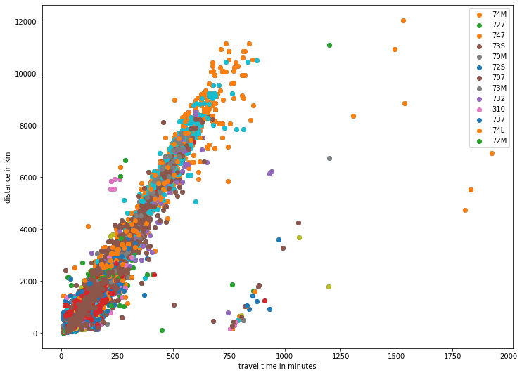

# Historic Flight Data Parser

The conclusive site http://www.departedflights.com/ has plenty of historic flight schedules. Unfortunately they are not in a machine-readable format.

This repository allows you to parse the data and then access the data for e.g. statistics.

> Disclaimer: This repository does not contain the data itself, but only provides the tools to parse the original data.

## Download the original data

To parse the data, you first need to download it. This is easily done with a recursive wget command which downloads each html file once with infinite recursion (this is needed for deep pagination):

    wget -nc -r -l inf -A ".html" http://www.departedflights.com/

This results in around 23000 files and 210 MB of source files. To easily handle the files, rename the directory to `scrape`.

Additionally, you need the `https://raw.githubusercontent.com/jpatokal/openflights/master/data/airports.dat` file for time zones and coordinates.

## Scope
So far, the script is only tested against the international schedules for 83,89 and 96. The main challenge is to map the departure airport names to IATA codes. This mapping is handled in the `assign.json` file.

## Usage

Uncomment one of the dates in `run.py`

    #scheddate = date(1983,7,1)
    #scheddate = date(1989,1,15)
    scheddate = date(1996, 10, 1)

and execute `python run.py`

## Statistics

One direct plot derived from the data is the distance over time for different aircraft types:

The parallel line with a time offset of 720 minutes is caused by typos in the am/pm notation of departure and arrival times.